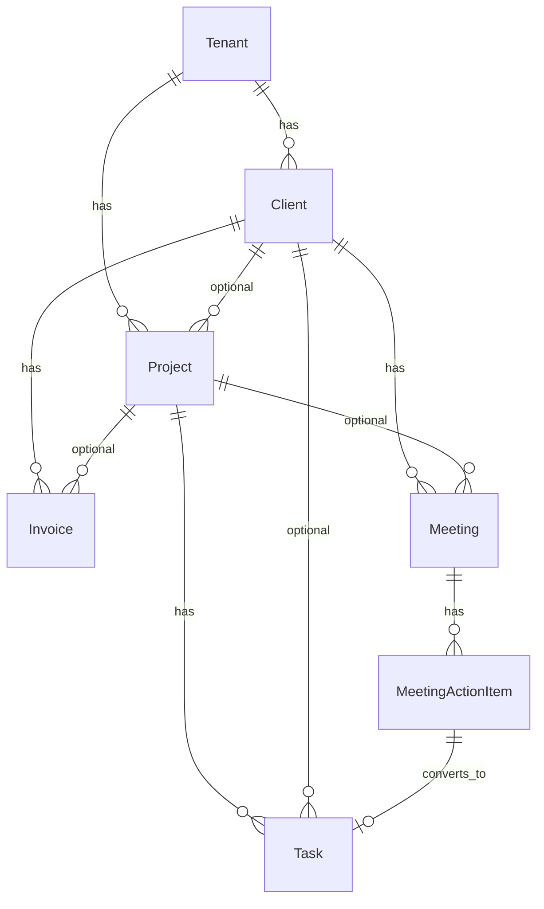

# Orion — database model

Source of truth: `backend/prisma/schema.prisma` (PostgreSQL via Prisma Migrate).

## Multi-tenancy

Every business entity is scoped with `tenant_id`. Users belong to tenants through `memberships` with a **role** (`OWNER`, `ADMIN`, `MANAGER`, `EMPLOYEE`, `FINANCE`, `VIEWER`). All API queries must filter by the active tenant from the authenticated session.

## Entity map

| Domain | Models | Notes |
|--------|--------|--------|
| Identity | `Tenant`, `User`, `Membership` | One user, many tenants |
| CRM | `Client`, `Tag`, `ClientTag` | Status: lead → prospect → active → inactive |
| Projects | `Project`, `ProjectMember`, `ProjectNote` | Progress 0–100, optional `client_id` |
| Tasks | `Task` | Optional `project_id` / `client_id`, assignee, due date |
| Meetings | `Meeting`, `MeetingParticipant`, `MeetingActionItem` | `task_id` on action item when converted to task |
| Finance | `Invoice` | Amounts in **minor units** (`amount_cents`); `OVERDUE` can be maintained by a nightly job from `SENT` + `due_date` |
| Platform | `ActivityLog`, `Notification` | Feed + in-app / email hooks |

## KPIs (dashboard)

Suggested **read models** (computed in a service or SQL view, not stored redundantly unless you add materialized views):

- **Active clients** — `Client` where `status = ACTIVE` and `deleted_at` null  
- **Active projects** — `Project` where `status IN (PLANNED, ACTIVE, BLOCKED)`  
- **Open tasks** — `Task` where `status != DONE`  
- **Outstanding invoices** — sum `amount_cents` where `status IN (SENT, OVERDUE)`  
- **Monthly revenue** — sum `amount_cents` where `status = PAID` and `paid_at` in selected month  
- **Overdue invoices** — count or sum where `status = OVERDUE` (or `SENT` and `due_date < today`)

**Trends** — compare current period window to previous period (same queries with shifted dates).

## Relation graph (core)



## Migration from `sql/001_core.sql`

Older installs used raw SQL (`tenants`, `users`, `memberships`, `companies`, `projects`, `audit_logs`). **Greenfield** SaaS deployments should use Prisma only. If you must migrate data: map `companies` → `clients`, align `memberships.role` to the new enum, then retire duplicate tables.

## Commands

```bash
cd backend
cp .env.example .env   # set DATABASE_URL
npx prisma migrate dev --name init
npm run db:seed
npm run db:studio
```
