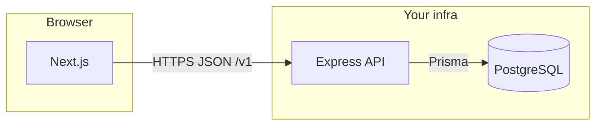

# Orion — production SaaS architecture

This document is the **single reference** for turning the monorepo into a **production B2B SaaS**: structure, data model, API, UI, RBAC, and rollout phases.  
Implementation anchors: `backend/prisma/schema.prisma`, `backend/src/` (API), `apps/orion-web/` (Next.js).

---

## 1. Project architecture

### 1.1 Principles

- **Multi-tenant by row:** every business table carries `tenant_id`; no cross-tenant queries without explicit system scope.
- **Modular domains:** clients, projects, tasks, meetings, finance, platform (auth, audit, notifications) — each gets services + API boundary + UI routes.
- **API-first:** the Next app consumes versioned HTTP APIs (today Express; optional future: colocate Route Handlers in Next for edge/caching).
- **Audit everywhere:** mutations write `ActivityLog`; soft deletes preserve history where it matters.

### 1.2 Recommended monorepo layout

```
hohoh-pkg-builder/
├── apps/
│   └── orion-web/              # Primary SaaS UI (Next.js App Router)
├── backend/
│   ├── prisma/
│   │   ├── schema.prisma        # Source of truth for PostgreSQL
│   │   ├── migrations/
│   │   └── seed.mjs
│   └── src/
│       ├── server.mjs           # Express bootstrap
│       ├── appApi.mjs           # /v1/app/* (evolve → services/)
│       ├── prisma.mjs
│       └── security.mjs
├── packages/                    # (Optional next step)
│   ├── db/                      # Shared Prisma client + types (if web uses server actions only)
│   └── ui/                      # Shared design tokens / primitives
├── webapp/                      # Legacy Vite app (localStorage) — parallel until migrated
└── docs/orion/                  # Architecture & API specs
```

**Direction:** treat **`apps/orion-web`** as the **canonical SaaS frontend**; keep **`webapp/`** until feature parity or sunset.

### 1.3 Runtime diagram



**Auth (target):** Auth.js (NextAuth v5) in Next issues sessions; API receives **Bearer access token** or **session cookie** via BFF pattern (Next proxies to API with service identity) — choose one strategy and document it; avoid long-lived tenant slug headers in production.

---

## 2. Prisma schema

### 2.1 Canonical file

**`backend/prisma/schema.prisma`** — apply with `npx prisma migrate dev`.

### 2.2 Entity map (business modules)

| Module | Models | Relationships |
|--------|--------|----------------|
| Tenancy | `Tenant`, `Membership` | User ↔ many tenants via `Membership` |
| Identity | `User`, `Account`, `Session`, `VerificationToken` | Auth.js-ready OAuth + DB sessions |
| Clients | `Client`, `Tag`, `ClientTag` | Client ↔ many tags; optional `accountManager` → User |
| Projects | `Project`, `ProjectMember`, `ProjectNote` | Project → optional `Client`; many `Task`, `Meeting`, `Invoice` |
| Tasks | `Task` | Optional `Project` + `Client`; assignee → User |
| Meetings | `Meeting`, `MeetingParticipant`, `MeetingActionItem` | Action item → optional `Task` (convert flow) |
| Finance | `Invoice` | Client required; Project optional; amounts in **cents** |
| Platform | `ActivityLog`, `Notification` | Tenant-scoped; actor → User |

### 2.3 Business rules (enforced in services + DB constraints)

- Client **1—*** projects, invoices, tasks, meetings (optional links).
- Project **belongs to** at most one client (`clientId` optional but recommended).
- Task may reference **client and/or project** (cross-cutting work).
- Meeting action item **→** task via `MeetingActionItem.taskId`.
- Invoice **requires** client; project optional.
- Status enums on `Client`, `Project`, `Task`, `Invoice`; `ActivityLog` records changes.

### 2.4 RBAC mapping (product ↔ schema)

| Product role | Prisma `MembershipRole` | Notes |
|--------------|-------------------------|--------|
| admin | `ADMIN` (or `OWNER` for billing owner) | Full tenant config + users |
| manager | `MANAGER` | CRUD most operational entities |
| employee | `EMPLOYEE` | Scoped create/read/update on assigned work |
| finance | `FINANCE` | Invoices, read clients/projects, no task delete |
| (read-only) | `VIEWER` | Optional tier |

`OWNER` is retained for **workspace ownership / billing**; map “admin” in UI to `ADMIN` + document that one `OWNER` exists per tenant.

---

## 3. API design

### 3.1 Conventions

- **Base:** `/v1`
- **Headers:** `Authorization: Bearer <token>` (target); interim: `X-Tenant-Slug` only in **development**.
- **Errors:** `{ error: { code, message, details? } }` with stable `code` for clients.
- **Lists:** cursor or `page` + `limit`; `sort`, `filter` as query params.
- **Idempotency:** `Idempotency-Key` on POST for invoices/payments (future).

### 3.2 Route groups (production target)

| Group | Routes | Purpose |
|-------|--------|---------|
| **Auth** | `POST /v1/auth/register`, `POST /v1/auth/login`, `POST /v1/auth/refresh`, `GET /v1/auth/me` | Sessions / JWT |
| **Tenant context** | `GET /v1/tenants`, `POST /v1/tenants`, `PATCH /v1/tenants/current` | Workspace + settings JSON |
| **Dashboard** | `GET /v1/dashboard/summary` | KPIs, actions, activity slice |
| **Clients** | `GET/POST /v1/clients`, `GET/PATCH/DELETE /v1/clients/:id`, sub-resources projects/invoices/tasks |
| **Projects** | `GET/POST /v1/projects`, `GET/PATCH/DELETE /v1/projects/:id`, members, notes |
| **Tasks** | `GET/POST /v1/tasks`, `PATCH /v1/tasks/:id`, `GET /v1/tasks?view=kanban|calendar` |
| **Meetings** | `GET/POST /v1/meetings`, `POST /v1/meetings/:id/action-items/:itemId/convert-task` |
| **Invoices** | `GET/POST /v1/invoices`, `PATCH /v1/invoices/:id`, `POST /v1/invoices/:id/send` |
| **Finance overview** | `GET /v1/finance/summary?from=&to=` | Revenue, outstanding, aging |
| **Search** | `GET /v1/search?q=` | Grouped results |
| **Notifications** | `GET /v1/notifications`, `PATCH /v1/notifications/:id/read` |
| **Activity** | `GET /v1/activity` | Paginated log (permission-gated) |
| **Team** | `GET/POST /v1/memberships`, `PATCH /v1/memberships/:id` | Roles |

**Current repo:** read-only **`/v1/app/*`** implemented in `backend/src/appApi.mjs` for Next SSR — evolve into the table above with auth middleware + permission checks.

---

## 4. Page structure (Next.js App Router)

Root: `apps/orion-web/src/app/`

```
app/
├── (marketing)/                 # Optional: landing, legal
├── (auth)/
│   ├── login/page.tsx
│   ├── register/page.tsx
│   └── layout.tsx
├── (app)/                       # Authenticated shell
│   ├── layout.tsx               # Sidebar + top bar + tenant switcher
│   ├── dashboard/page.tsx
│   ├── clients/
│   │   ├── page.tsx             # List + filters
│   │   ├── [id]/page.tsx        # Profile tabs: overview, projects, invoices, tasks, meetings
│   │   └── new/page.tsx
│   ├── projects/
│   │   ├── page.tsx
│   │   ├── [id]/page.tsx        # Tasks, notes, meetings, invoices
│   │   └── new/page.tsx
│   ├── tasks/
│   │   ├── page.tsx             # Default list
│   │   ├── board/page.tsx
│   │   └── calendar/page.tsx
│   ├── meetings/
│   │   ├── page.tsx
│   │   └── [id]/page.tsx        # Action items + “convert to task”
│   ├── invoices/
│   │   ├── page.tsx
│   │   └── [id]/page.tsx
│   ├── finance/
│   │   └── page.tsx             # Charts + tables (uses /v1/finance/summary)
│   ├── settings/
│   │   ├── company/page.tsx     # Branding, VAT, defaults
│   │   ├── team/page.tsx        # Members + roles
│   │   └── billing/page.tsx     # Plan, Stripe portal
│   ├── activity/page.tsx
│   └── search/page.tsx
├── layout.tsx
└── globals.css
```

**UX:** each list page = **filters + saved views** (future); each detail page = **right-hand context** (related records) + **activity strip**.

---

## 5. Reusable component list

| Layer | Components |
|-------|------------|
| **Primitives** | `Button`, `Input`, `Select`, `Textarea`, `Checkbox`, `Switch`, `Tooltip`, `Dialog`, `Dropdown`, `Tabs` |
| **Data** | `DataTable` (sort, paginate, empty state), `StatusBadge`, `Currency`, `DateDisplay`, `UserAvatar` |
| **Layout** | `AppShell`, `Sidebar`, `TopBar`, `PageHeader`, `CommandPalette` (global search) |
| **Domain** | `ClientCard`, `ProjectProgress`, `TaskRow`, `KanbanColumn`, `InvoiceStatusBadge`, `MeetingTimeline` |
| **Feedback** | `Toast`, `Skeleton`, `ErrorBanner`, `EmptyState` (title, description, CTA) |

Design tokens: CSS variables for **surface**, **border**, **accent**, **semantic** (success/warning/danger) — already started in `apps/orion-web/src/app/globals.css`.

---

## 6. Seed data

**File:** `backend/prisma/seed.mjs`

- One **tenant** `demo-acme`, users (owner, manager, finance), **tags**, **clients**, **project** with **members**, **tasks**, **meeting** with **action items**, **invoices**, **activity** rows, **notification**.

**Rule:** seeds must be **idempotent** for CI (use `upsert` for fixed slugs) before production pipelines depend on them.

---

## 7. Role & permission strategy

### 7.1 Layers

1. **Database:** tenant isolation (`tenant_id` on every row).
2. **API middleware:** resolve `userId` + `tenantId` + `MembershipRole`.
3. **Authorization service:** `can(user, tenant, 'invoice:send')` — central matrix.
4. **UI:** hide destructive actions; server remains source of truth.

### 7.2 Example matrix (default)

| Action | ADMIN | MANAGER | EMPLOYEE | FINANCE | VIEWER |
|--------|-------|---------|----------|---------|--------|
| Client CRUD | ✓ | ✓ | read | read | read |
| Project CRUD | ✓ | ✓ | member-scoped | read | read |
| Task CRUD | ✓ | ✓ | own / project | read | read |
| Meeting CRUD | ✓ | ✓ | participant | read | read |
| Invoice CRUD / send | ✓ | read | — | ✓ | read |
| Team / roles | ✓ | invite | — | — | — |
| Company settings | ✓ | — | — | — | — |

Store **optional** `permissionOverrides` JSON on `Membership` later for enterprise.

---

## 8. Phased roadmap

### MVP (6–10 weeks)

- Auth.js email + DB session; tenant create + invite; replace `X-Tenant-Slug` in prod.
- Clients, projects, tasks (list + detail), meetings (incl. convert action → task), invoices (lifecycle).
- Dashboard read API + real charts for finance summary (basic).
- Activity log on mutations; notifications table + bell (in-app only).
- RBAC enforced on API; settings: company + team.

### v1.1

- Kanban + calendar for tasks; global search (Postgres full text); exports (CSV/PDF).
- Stripe billing + plan limits; feature flags from `platform-config`.

### v2

- Automations, webhooks, public API keys; advanced reporting; optional mobile PWA.

---

## Related docs

- [01-DATABASE.md](./01-DATABASE.md) — ER overview & KPI notes  
- [02-API.md](./02-API.md) — detailed REST sketch  
- [03-FRONTEND.md](./03-FRONTEND.md) — folder conventions  
- [04-PRODUCT-ROADMAP.md](./04-PRODUCT-ROADMAP.md) — pricing & themes  

---

*Document version: 2026-04 — aligns with Orion monorepo state.*
